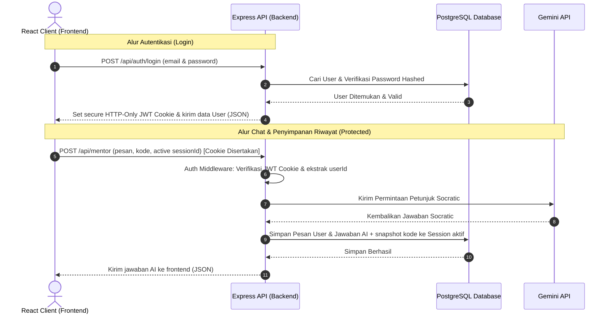

# Cetak Biru: Autentikasi Pengguna & Penyimpanan Riwayat Percakapan MentorJS

Dokumen ini merangkum rencana arsitektur, desain sistem, skema database, kontrak API, dan langkah-langkah implementasi untuk menambahkan fitur **Autentikasi Pengguna** dan **Penyimpanan Riwayat Sesi Chat** pada proyek MentorJS.

---

## 🏛️ Arsitektur Sistem & Alur Data

Setelah fitur autentikasi dan penyimpanan riwayat ditambahkan, alur request akan melibatkan verifikasi auth dan operasi baca/tulis ke database PostgreSQL:



---

## 💾 Desain Skema Database (PostgreSQL - Opsi A Relasional)

Kita akan menggunakan **PostgreSQL** dengan model relasional murni yang dinormalisasi:

### 1. Tabel User (`User`)
Menyimpan data akun pengguna dan password yang telah di-hash.

```prisma
model User {
  id        Int       @id @default(autoincrement())
  username  String    @unique
  email     String    @unique
  password  String    // Password di-hash menggunakan bcryptjs
  createdAt DateTime  @default(now())
  sessions  Session[]
}
```

### 2. Tabel Sesi Belajar (`Session`)
Menyimpan informasi sesi chat / topik belajar pengguna.

```prisma
model Session {
  id             String    @id @default(uuid())
  userId         Int
  title          String    @default("Sesi Belajar Baru")
  lastSavedCode  String    @default("")
  createdAt      DateTime  @default(now())
  updatedAt      DateTime  @updatedAt
  user           User      @relation(fields: [userId], references: [id], onDelete: Cascade)
  messages       Message[]
}
```

### 3. Tabel Pesan (`Message`)
Menyimpan setiap baris pesan obrolan dalam suatu sesi belajar.

```prisma
model Message {
  id         Int      @id @default(autoincrement())
  sessionId  String
  sender     String   // berisi "user" atau "mentor"
  text       String
  createdAt  DateTime @default(now())
  session    Session  @relation(fields: [sessionId], references: [id], onDelete: Cascade)
}
```

---

## 🔌 Desain Kontrak API

Semua request ke endpoint riwayat dan pengiriman prompt mentor wajib menyertakan token JWT yang valid melalui secure cookie `httpOnly`.

### 🔑 Endpoint Autentikasi (`/api/auth`)

| Metode | Endpoint | Deskripsi | Protected? | Parameter Body |
| :--- | :--- | :--- | :--- | :--- |
| **POST** | `/api/auth/register` | Mendaftarkan akun baru, men-hash password, dan menyimpannya ke DB. | Tidak | `{ username, email, password }` |
| **POST** | `/api/auth/login` | Memvalidasi kredensial, mengeluarkan cookie JWT pada browser. | Tidak | `{ email, password }` |
| **POST** | `/api/auth/logout` | Menghapus Cookie JWT dari browser pengguna. | Ya | `Tidak ada` |
| **GET** | `/api/auth/me` | Mengembalikan detail profil pengguna yang sedang login. | Ya | `Tidak ada` |

### 📚 Endpoint Riwayat & Sesi (`/api/history`)

| Metode | Endpoint | Deskripsi | Protected? | Parameter Body/URL |
| :--- | :--- | :--- | :--- | :--- |
| **GET** | `/api/history` | Mengambil daftar semua sesi belajar milik pengguna (hanya metadata). | Ya | `Tidak ada` |
| **POST** | `/api/history` | Membuat sesi belajar baru (membuat ruang chat baru). | Ya | `{ title, initialCode }` |
| **GET** | `/api/history/:sessionId` | Mengambil daftar pesan lengkap dan snapshot kode untuk sesi tertentu. | Ya | `sessionId` (di URL) |
| **PUT** | `/api/history/:sessionId` | Menyimpan perubahan pesan baru dan update snapshot kode ke DB. | Ya | `{ messages: [...], lastSavedCode }` |
| **DELETE** | `/api/history/:sessionId` | Menghapus sesi belajar tertentu dari database. | Ya | `sessionId` (di URL) |
